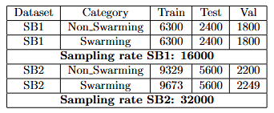
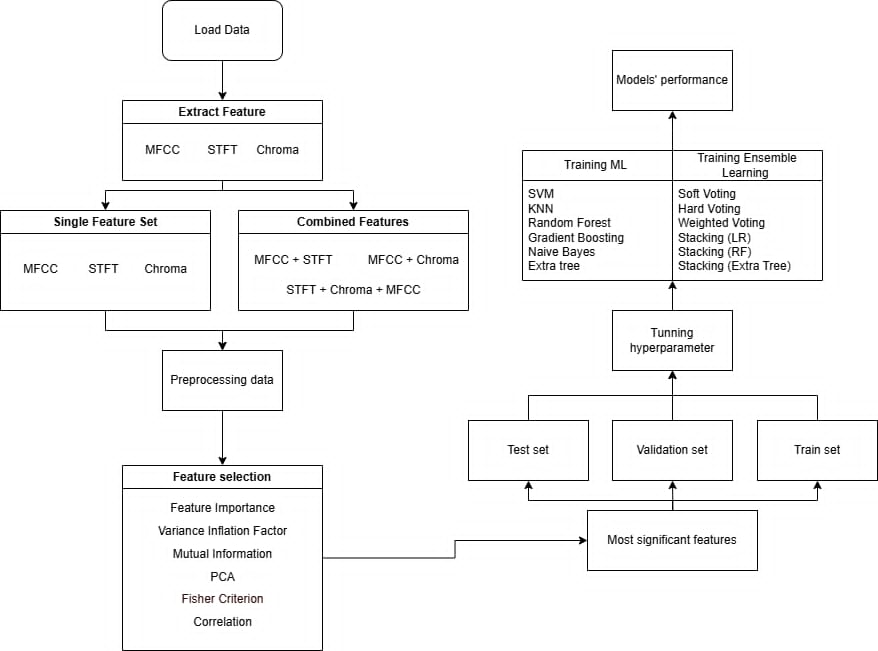
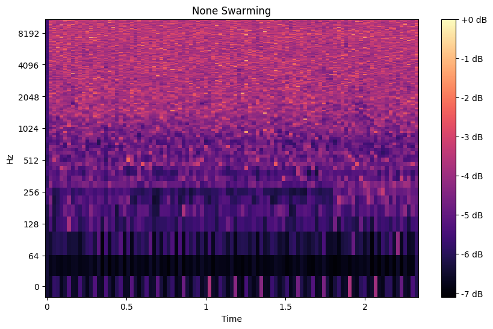
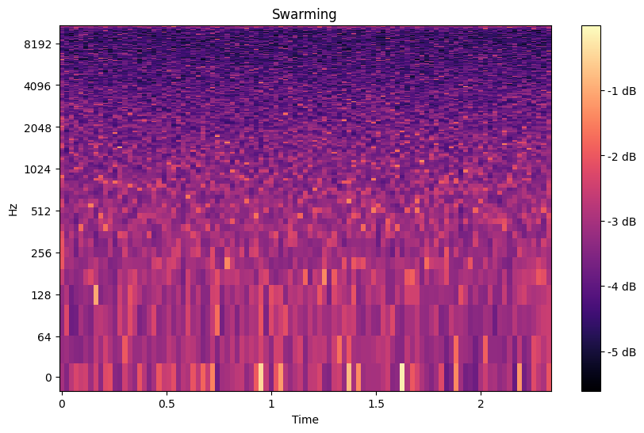

# Bee Swarming Detection from Acoustic Signals

Machine-learning research on non-invasive bee-swarming detection using handcrafted acoustic features, feature-selection strategies, hyperparameter tuning, and ensemble learning.



## Project Overview

Bee colonies produce acoustic patterns that change with colony state. This project studies whether those patterns can be used to distinguish **swarming** from **non-swarming** activity without physically disturbing the hive.

The work focuses on the experimental methodology rather than deployment: how audio is preprocessed, which acoustic representations are useful, how feature combinations affect performance, and how classical machine-learning models can be tuned and combined for robust classification.

### Processing Pipeline

The overall workflow combines acoustic preprocessing, handcrafted feature extraction, feature selection, model training, tuning, and ensemble evaluation.

<p align="center">
  
</p>

<p align="center"><i>End-to-end experimental pipeline for acoustic bee-swarming classification.</i></p>

## Research Focus

The project investigates four connected questions:

- How well do **MFCC**, **STFT**, and **Chroma** characterize bee-colony acoustics?
- Do combinations of these representations improve discrimination between colony states?
- How much can feature selection and dimensionality reduction improve classical ML models?
- How robust are the resulting models across two datasets constructed with different recording and split conditions?

## Acoustic Preprocessing

The notebooks document a custom preprocessing and feature-engineering strategy built around `librosa` and NumPy. Experiments include:

- audio resampling,
- pre-emphasis filtering,
- MFCC extraction,
- second-order MFCC delta features,
- Hann-window STFT magnitude features,
- Chroma features,
- mean / variance / maximum statistical aggregation,
- feature concatenation,
- correlation-based feature selection,
- PCA-based dimensionality reduction.

The goal is to convert variable-length hive recordings into compact feature vectors suitable for classical machine-learning models.

### Swarming vs. Non-Swarming Spectrograms

The examples below show the time-frequency representation of recordings from the two target colony states. They provide a qualitative view of how acoustic energy patterns can differ between **non-swarming** and **swarming** samples. The classification pipeline itself does not rely on a single visual pattern; these signals are represented through MFCC, STFT, Chroma, and aggregated statistical features before model training.

<table>
  <tr>
    <td align="center" width="50%">
      
    </td>
    <td align="center" width="50%">
      
    </td>
  </tr>
  <tr>
    <td align="center"><b>Non-swarming</b></td>
    <td align="center"><b>Swarming</b></td>
  </tr>
</table>

## Model Exploration

The study evaluates multiple model families, including:

- K-Nearest Neighbors
- Support Vector Machines
- Random Forest
- Extra Trees
- Gradient Boosting
- Naive Bayes

The experiment notebooks also document hyperparameter tuning using validation-based and cross-validation strategies, together with model-combination experiments such as voting and stacking.

## SB1 and SB2

Two bee-audio datasets are used to test different aspects of generalization. The raw datasets are **not distributed in this repository**.

**SB1** is designed as the stronger generalization test. Its training, validation, and test partitions are separated using collection time, location, and swarming-state conditions so that evaluation data remain meaningfully unseen.

**SB2** emphasizes recording diversity, including variation across collection days and recording devices, while keeping train/validation/test partitions independent.

More detail is available in [`docs/dataset_notes.md`](docs/dataset_notes.md).

## Results

The repository keeps compact result summaries separately from the exploratory notebooks.

For example, the tracked MFCC comparison contains Random Forest test accuracy of approximately **98.99%**, while the tracked feature-selection comparison reaches approximately **99.22% test accuracy** for the `std` selection configuration. These tables are snapshots of specific experiment groups rather than a claim that every experiment achieves the same performance.

- [`results/model_performance_comparison.csv`](results/model_performance_comparison.csv)
- [`results/feature_selection_comparison.csv`](results/feature_selection_comparison.csv)
- [`results/report_MFCC.xlsx`](results/report_MFCC.xlsx)

The full research narrative and additional experiment discussion are kept in [`Bee_Swarming_research.pdf`](Bee_Swarming_research.pdf). This document is a **research manuscript and is not presented here as a published paper**.

## Repository Organization

```text
BeeSwarming/
├── README.md
├── LICENSE
├── Bee_Swarming_research.pdf
│
├── assets/
│   ├── Bee.png
│   ├── BeePipeline.png
│   ├── non-swarming.png
│   └── swarming.png
│
├── docs/
│   └── dataset_notes.md
│
├── experiments/
│   ├── feature_extraction/
│   │   ├── mfcc/
│   │   ├── stft/
│   │   ├── chroma/
│   │   └── combined/
│   ├── model_training/
│   │   ├── mfcc/
│   │   ├── stft/
│   │   ├── chroma/
│   │   └── combined/
│   ├── feature_selection/
│   └── archive/
│
└── results/
```

The notebooks are intentionally retained because this repository is a record of the **research process and training strategy**, not a packaged application or public dataset release.

## Experiment Guide

Feature extraction experiments are grouped by acoustic representation. Model-training notebooks are then separated by feature family and, where applicable, by SB1/SB2. Obvious duplicate or superseded notebooks are retained under `experiments/archive/` instead of being mixed with the main experiment path.

See [`experiments/README.md`](experiments/README.md) for the notebook map.

## Data Availability

The raw bee-audio datasets are private and are **not included** in the repository. Paths inside some historical notebooks reflect the original local research environment and are preserved as part of the experiment record.

The repository is therefore intended to present:

**preprocessing strategy → feature engineering → model training → tuning → evaluation**, rather than provide a one-command reproducibility package.

## Research Status

This repository documents an internal research study. `Bee_Swarming_research.pdf` is provided as a research manuscript/report and should not be interpreted as evidence of publication or conference acceptance.
